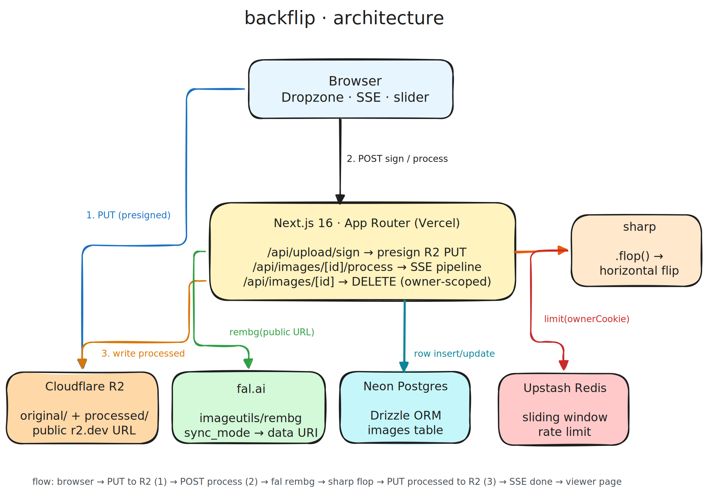

# backflip

Cut the background. Then flip it.

Upload an image → background removed → mirrored horizontally → hosted at a permanent URL. No signup, no friction.

**Live:** https://www.backflip.page

Built for the Uplane take-home in ~12 hours.

---

## The brief

> Build a full-stack app where a user uploads an image, the backend removes the background via a third-party service, flips it horizontally, hosts the result, and exposes deletion. TypeScript backend, deployed online, GitHub repo.

What I shipped:

- Drag, paste, or click-to-upload (any PNG/JPEG/WebP up to 10 MB)
- Live pipeline view (no fake spinners — real stages over SSE)
- Before/after slider on the result
- Public shareable viewer URL with OG image
- Cookie-scoped dashboard (your images, your delete button)
- One-click PNG download with proper filename
- Rate limited (no one nukes my fal.ai credits)
- 404, error, and loading boundaries on every route

---

## Architecture



> Editable source: [`docs/architecture.excalidraw`](docs/architecture.excalidraw) — open at [excalidraw.com](https://excalidraw.com/).

Plain English: browser uploads straight to R2 with a presigned URL (no bytes through Next), then asks the server to process. Server hands fal.ai the **public R2 URL**, gets a transparent PNG back, runs `sharp.flop()` to mirror it, and writes the result back to R2. Status streams back over Server-Sent Events the whole time.

---

## Stack

| Layer | Pick | Why |
|---|---|---|
| Framework | **Next.js 16 (App Router)** | RSC + Route Handlers = single TS codebase, no separate API server |
| Hosting | **Vercel** | Native Next, free tier covers this, deploys on push |
| Storage | **Cloudflare R2** | S3-compatible, zero egress fees, custom domain ready |
| Background removal | **fal.ai `imageutils/rembg`** | Free, accepts URLs directly, `sync_mode` returns inline data URI (one round-trip) |
| Image transform | **sharp** (`.flop()`) | Battle-tested, instant, runs in Node runtime on Vercel |
| Database | **Neon Postgres + Drizzle ORM** | Serverless Postgres, typed queries, branch-per-PR |
| Rate limit | **Upstash Redis** | REST-based, edge-friendly, sliding window primitive built-in |
| Validation | **zod** (req bodies) + **@t3-oss/env-nextjs** (env vars) | Fail loud at the boundary, never at runtime |
| Lint/format | **biome** | One tool, fast, no eslint+prettier dance |
| UI | Tailwind v4 + Lucide + Sonner | shadcn-style buttons, hand-rolled (~80 lines) — no bloat |

> **Why not Workers AI for rembg?** Cloudflare quietly removed `briaai/rembg-1.4` from the catalog (verified via `/ai/models/search` — only text + text-to-image models remain). fal.ai gives the same model with $0-per-second pricing and a cleaner DX (just pass a URL).

---

## How a request flows

```
1.  Browser → POST /api/upload/sign
              { filename, contentType, size }
    Server → zod validate → upstash rate-limit (20/hr/cookie)
           → presign R2 PUT URL → insert "uploaded" row in Neon
           ← { imageId, uploadUrl }

2.  Browser → PUT uploadUrl  (XHR, progress tracked)
              raw bytes go straight to R2, never through Next

3.  Browser → POST /api/images/[id]/process  (SSE)
    Server → set status="processing"
           → fal.ai rembg(publicR2Url) → transparent PNG
           → sharp(...).flop().png() → flipped PNG
           → PUT processed/<id>.png to R2
           → set status="done", processedKey
           ← stream: rembg → flip → upload → done

4.  Browser ← { stage: "done", publicId }
            → shows before/after slider
            → /i/<publicId>  is now a public, shareable URL with OG image
```

Deletion does the obvious thing: ownership check via signed cookie, then `Promise.allSettled([deleteOriginal, deleteProcessed])`, then drop the row.

---

## TypeScript notes

- Strict mode on. No `any` outside of one narrowly-typed AWS SDK edge.
- Types live next to the code that uses them. No `src/types/` dump.
- Runtime validation at every boundary: incoming request bodies (zod), env vars (T3 env), API responses from fal.ai (typed, defensive parse).
- Inferred types from Drizzle (`typeof images.$inferSelect`) flow through queries → API → client without manual re-declaration.

---

## Local dev

```bash
nvm use 22                     # .nvmrc pins this
pnpm install
cp .env.example .env.local     # fill in
pnpm db:push                   # creates `images` table on Neon
pnpm dev                       # http://localhost:3000
```

That's it.

### Scripts

| | |
|---|---|
| `pnpm dev` | Next dev (turbopack) |
| `pnpm build` | Production build |
| `pnpm typecheck` | `tsc --noEmit` |
| `pnpm check` | Biome lint + format + autofix |
| `pnpm db:push` | Apply Drizzle schema to Neon |
| `pnpm db:studio` | Open Drizzle Studio |

---

## Env vars

| Key | What | Where to get |
|---|---|---|
| `DATABASE_URL` | Neon pooled connection string | https://neon.tech |
| `R2_ACCOUNT_ID` | CF account id | dashboard sidebar |
| `R2_ACCESS_KEY_ID` / `R2_SECRET_ACCESS_KEY` | R2 API token (Object R/W on bucket) | R2 → API tokens |
| `R2_BUCKET` | bucket name (default: `backflip`) | — |
| `R2_PUBLIC_URL` | bucket's r2.dev URL or your custom domain | R2 → bucket → settings |
| `FAL_KEY` | fal.ai API key | https://fal.ai/dashboard/keys |
| `UPSTASH_REDIS_REST_URL` / `UPSTASH_REDIS_REST_TOKEN` | Upstash Redis REST creds | upstash console |
| `NEXT_PUBLIC_SITE_URL` | canonical site origin (for `metadataBase`) | — |

---

## Tradeoffs (the honest part)

- **Cookie ownership, not auth.** "Your images" = whatever browser dropped this cookie. Spec didn't require auth and adding it adds a paywall on a take-home. With a week I'd bolt on better-auth (email link), keep the cookie path as anon fallback.
- **Polling on the dashboard.** When an upload is in flight, the dashboard `router.refresh()`es every 2.5s. Simple, works, doesn't need a websocket gateway. Would replace with a real subscription if there were ever >5 concurrent uploads per user.
- **Lazy DB / Redis init.** Both are proxied behind a getter so `next build` works without env (`SKIP_ENV_VALIDATION=true`). Slight indirection, big DX win.
- **`sharp` chose Vercel for me.** Workers don't run native modules, which means Cloudflare-only hosting (OpenNext + WASM) would have cost 3+ hours of yak-shaving I didn't have. Vercel + CF data plane is the pragmatic split.
- **No queue.** A single process generator runs the pipeline inline on the request. Fine at low scale; would move to a queue (Upstash QStash or Vercel Queues) once any step crosses 10s p95.

---

## With another week

- Sign-in (better-auth, email link). Migrate cookie rows on first login.
- Batch uploads + bulk download as a zip.
- Format presets (transparent PNG, white-bg JPG, blurred-bg JPG).
- Undo last 5 actions.
- Server-side OG card per image (canvas snapshot).
- Lightweight Playwright smoke test in CI.
- Switch from Vercel + CF to OpenNext on Cloudflare Workers once `sharp` has a sane WASM swap.

---

## Cost

All free tiers. Build cost so far: **$0**.

- Vercel Hobby: 0
- Neon Free: 0
- Upstash Free: 0
- R2: 0 (storage well under 10 GB, no egress fees)
- fal.ai: $0/sec for `imageutils/rembg`

---

## Repo layout

```
app/
  page.tsx                      landing + UploadStage
  i/[publicId]/                 public viewer + /raw download + loading + not-found
  dashboard/                    cookie-scoped grid
  api/
    upload/sign/                presign R2 PUT
    images/                     GET (list), [id]/ (DELETE), [id]/process/ (SSE)
  opengraph-image.tsx           1200×630 social card

src/
  components/                   ui buttons, dropzone, stages, before-after, grid
  hooks/use-image-pipeline.ts   client orchestration (sign → PUT → SSE)
  schemas/upload.ts             zod request schemas
  server/                       backend only — never imported from client
    db/{schema,client,queries}.ts
    r2.ts, ai.ts, pipeline.ts, session.ts, rate-limit.ts
  lib/                          cn, format, api-error

docs/architecture.excalidraw    diagram source
```

Backend lives in `src/server/*`. Exposed through `app/api/*` route handlers. One repo, one deploy, one source of truth.

---

Built by [Mohanad Kandil](https://github.com/mohanadkandil) for the Uplane take-home, 2026.
